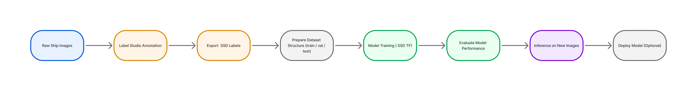

# SSD Single Shot Detector — Ship Detection

[](LICENSE) []

**Professional, reproducible, notebook-first template for SSD (Single Shot Detector) ship detection experiments.**

---

## Overview

This repository provides a concise and professional scaffold for developing and sharing SSD-based ship detection experiments, particularly suited to satellite and aerial imagery research. It is intentionally **minimal** and **notebook-first**: include your primary Jupyter notebook (e.g., `ssd_single_shot_detector_ship.ipynb`) and this repository will serve as a clear, reproducible package for reviewers and collaborators.

Key goals:
- Clarity: well-documented README and data layout.  
- Reproducibility: `requirements.txt` and environment variables example.  
- Portability: Colab/Jupyter-compatible notebook workflow without committing large datasets or model weights.

---

## Features

- Notebook-first template ready for quick demonstration or reproducible experiments.
- Example dataset descriptor (`dataset/ships.yaml`) illustrating expected data layout.
- Professional flowchart (Mermaid source and rendered PNG) to document the pipeline visually.
- Clear LICENSE (MIT) and `.gitignore` to avoid accidental commits of secrets or large assets.
- Minimal, common dependency list in `requirements.txt` to get started quickly.

---

## Quickstart

### 1. Clone the repository and add your notebook
```bash
unzip SSD-Single-Shot-Detector-minimal.zip
cd SSD-Single-Shot-Detector-minimal
# Replace the placeholder with your notebook, e.g.:
mv /path/to/your/ssd_single_shot_detector_ship.ipynb ./ADD_YOUR_NOTEBOOK.ipynb
```

### 2. Create a virtual environment and install dependencies
```bash
python -m venv .venv
source .venv/bin/activate    # Windows: .venv\Scripts\activate
pip install -r requirements.txt
```

> **Recommendation:** Pin exact versions before running large experiments, e.g. `pip install ultralytics==8.x.x` or `pip freeze > requirements.txt` after validating in your environment.

---

## Data layout & Dataset YAML

Although this template is SSD-focused, a clear dataset structure is essential. Below is the recommended layout (adapt as needed for your SSD/TensorFlow input pipeline):

```
data/
  images/
    train/
    val/
    test/
  labels/
    train/
    val/
    test/
```

Example dataset descriptor (`dataset/ships.yaml`):

```yaml
nc: 1
names: ['ship']
train: ../data/images/train
val: ../data/images/val
test: ../data/images/test
```

**Important:** Do **not** commit large datasets or model weights to GitHub. Use cloud storage (S3, Google Drive) or Git LFS for heavy artifacts, and document download instructions in your README or a separate `DATA.md` file.

---

## Usage examples

### Run interactively (recommended for exploration)
Open the notebook in Jupyter or Colab and run cells sequentially. Ensure your environment has the required packages and your data paths are correct.

### Run programmatically (example pattern)
If you refactor training code into `train.py` (recommended for reproducibility), a typical command could look like:
```bash
python train.py --config configs/ssd_config.config --data dataset/ships.yaml --output runs/exp
```

### Inference example
A simple inference script would load checkpoint(s) and run predictions on images in `data/images/test/`, saving visualizations to `predictions/`.

---

## Flowchart

The repository includes a professional pipeline illustration:

- `flowchart_colored.mmd` — Mermaid source (editable).  
- `flowchart_colored.png` — Rendered diagram suitable for README embedding and presentations.



---

## Environment variables

Use `.env.example` to document non-sensitive environment variables. Copy to `.env` locally and update values as needed.

Example `.env.example`:
```env
DATA_DIR=./data
MODEL_DIR=./runs
LOG_LEVEL=INFO
```

---

## Best practices & recommendations

- Add Markdown cells to your notebook explaining each major block (data prep, model config, training, evaluation).  
- Convert critical code into importable modules (e.g., `src/data.py`, `src/train.py`) for testing and CI.  
- Add a small sample dataset (2–10 images + labels) for smoke tests and CI testing (kept under `tests/fixtures/` if desired).  
- Use `pre-commit` hooks (Black, isort, flake8) to maintain code quality.
- Track heavy artifacts (weights, datasets) with Git LFS or external storage and include download scripts in `tools/`.

---

## Contributing

Contributions are welcome. For substantial changes:
1. Fork the repository and create a feature branch.  
2. Run tests and linters locally.  
3. Open a PR with a clear description, motivation, and any relevant logs or screenshots.

See `CONTRIBUTING.md` for extended guidelines (if present).

---

## License & Author

This project is released under the **MIT License**.

Author: **Floyd Steev Santhmayer**

---

## Contact & Support

Open an issue in the repository for bug reports, feature requests, or questions. For faster responses, include: environment details, a minimal reproduction (notebook snippet), and expected vs. actual behavior.

